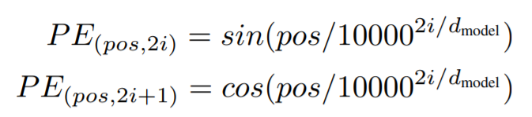

[TOC]

# Transformer 学习笔记

​		这是我自己在学习 Tranformer 过程中做的一些记录，初学者可以参考我的学习路径来进行学习，我建议所有人入门NLP的学习者都要自己完整地敲一遍 Transformer，对于基本功的锤炼是非常有效果的。

​		我也还在学习的过程中，所以关于 Transformer 的笔记也还会继续更新。 

## 论文

​		Transformer 模型的原始论文 [Attention Is All You Need](https://arxiv.org/pdf/1706.03762.pdf)

## 参考阅读

### The Annotated Transformer

​		首先是 AlexanderM. Rush 大佬（写这篇文章的时候是哈佛的助理教授，现在在康奈尔大学当副教授）的 [The Annotated Transformer](http://nlp.seas.harvard.edu/2018/04/03/attention.html)，这篇文章顾名思义，就是一个详细标注版的 Transformer 代码实现

​		如果英文阅读有一定困难的学习者可以参考知乎大佬[@迷途小书僮](https://www.zhihu.com/people/wuxianchao)的这个系列：

​		[The Annotated Transformer的中文注释版（1）](https://zhuanlan.zhihu.com/p/107889011)

​		[The Annotated Transformer的中文注释版（2）](https://zhuanlan.zhihu.com/p/107891957)

​		[The Annotated Transformer的中文注释版（3）](https://zhuanlan.zhihu.com/p/109003287)

***

​		PS. 在学习的过程中，有一个地方我和迷途小书僮大佬的理解有一些不同，Positional Embedding 的部分对公式的解释，我认为这样更为妥当，希望大家在看的时候注意一下，保持独立思考的习惯

​		公式里边的那个 i 代表的是维度，就是512维的第1维、第2维...第512维，而不是位置，这里容易搞混，一共(0, 2, ..., 510)，256个值，分别对应512维的奇数维和偶数维

​		（这部分参考我的代码和注释一起看比较好理解）

***

​		刚开始入门的学习者可以像我一样跟着[迷途小书僮大佬的这篇文章](https://zhuanlan.zhihu.com/p/107889011)先敲一遍（`TheAnnotatedTransformer.py`），有助于加深理解。

### The Illustrated Transformer

​		[Jay Alammar](https://jalammar.github.io/) 大佬的 [The Illustrated Transformer](https://jalammar.github.io/illustrated-transformer/)，非常详细地展示了 Transformer 的各种技术细节，和数据在其中的流动过程，顺便推荐一下他的博客，分享了很多技术干货，而且深入浅出，非常适合入门者学习（当然前提是你英文阅读能力ok）

​		英文阅读有困难的同学可以看百度NLP和大数据文摘的译文 [BERT大火却不懂Transformer？读这一篇就够了](https://mp.weixin.qq.com/s/WDq8tUpfiKHNC6y_8pgHoA)

### B站的教学视频

- 老弓的学习日记：https://www.bilibili.com/video/BV1YU4y1c7UT

​		这个视频真是我学习 Transformer 路上的超级助力，up主非常详细地把 Transformer 里边的细节和知识点讲得非常清楚，堪称事无巨细，而且还举了一个例子，看的时候能比较直观地感受数据的流动过程，这不比各种付费课程强多了？看完别忘了一键三连！这个up主其他的深度学习相关的视频也做得非常好，干货满满。

- NLP从入门到放弃：https://www.bilibili.com/video/BV1dR4y1E7aL

​		这这个视频主要是各个技术关键点讲得非常清晰，并且是对着代码讲解，我个人是非常喜欢这种讲解的风格的。一样，看完别忘了一键三连！

​		

​		**这两位up主都自己写了一份 Transformer 的代码，而且都配有课件，可以在他们的视频下面获取，我就不贴链接了。**

## 代码

​		这个笔记中目前有两份代码

​		其中一份是我跟着[迷途小书僮大佬的这篇文章](https://zhuanlan.zhihu.com/p/107889011)敲一遍的

​		`TheAnnotatedTransformer.py`

​		另外一份是我自己理解之后自己写的，按照数据流动的顺序分了模块化，并且在代码中写了详细的注释，以及对于每个模块的知识点做了一些笔记，详见：

​		`Transformer_structure.ipynb`

## 知识点

### 关于参数初始化

​		建议先读一下苏剑林大佬的 [浅谈Transformer的初始化、参数化与标准化](https://zhuanlan.zhihu.com/p/400925524?utm_source=wechat_session&utm_medium=social&utm_oi=1400823417357139968&utm_campaign=shareopn)

​		其他关于参数初始化的笔记详见 `init` 文件夹

## 进阶学习

### 基于 transformers 的自然语言处理(NLP)入门

​		Datawhale 团队做的进阶教程：https://datawhalechina.github.io/learn-nlp-with-transformers/#/?id=%e5%9f%ba%e4%ba%8etransformers%e7%9a%84%e8%87%aa%e7%84%b6%e8%af%ad%e8%a8%80%e5%a4%84%e7%90%86nlp%e5%85%a5%e9%97%a8

​		这个进阶教程非常详细，从相关原理到 Transformer 里程碑式的工作 BERT，再到各种下游任务：文本分类、序列标注、问答......完全可以当做新手入门教程来读

​		顺便推荐一下 Datawhale 团队，这是一个专注于 AI 领域的开源组织，日常会分享大量 AI 领域的教程和咨询等，可以关注他们的公众号 Datawhale